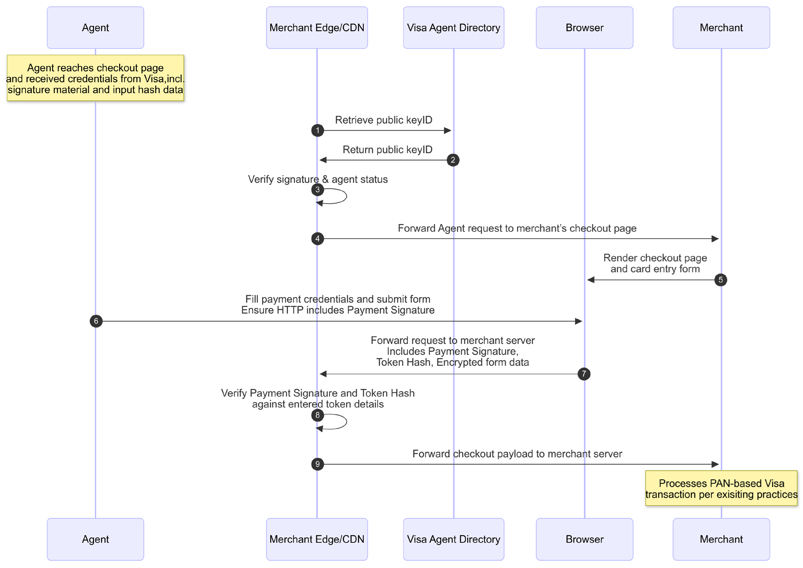

# Trusted Agent Protocol

*Establishing a universal standard of trust between AI agents and merchants for the next phase of agentic commerce.*

## The Challenge

AI agents are becoming part of everyday commerce, capable of executing complex tasks like booking travel or managing subscriptions. As agent capabilities evolve, merchants need visibility into their identities and actions more than ever.

For an agent to make a purchase, the **merchant** must be able to answer critical questions:

-  Is this a legitimate, trusted, and recognized AI agent?
-  Is it acting on behalf of a specific, authenticated user?
-  Does the agent carry valid instructions from the user to make this purchase?

Without a standard for recognition and communication, merchants are left with a difficult choice: block potentially valuable, agent-driven traffic, or blindly accept the significant operational and security risks that could come alongside agentic interactions of today.

## The Solution

Visa's **Trusted Agent Protocol** provides a standardized, cryptographic method for an AI agent to prove its identity and associated authorization directly to merchants. By presenting a secure digital signature with every interaction, a merchant can verify that an agent is legitimate and has the user's permission to act.

For merchants, the Trusted Agent Protocol describes a standardized set of mechanisms enabling merchants to:

- **Cryptographically Verify Agent Intent:** Instantly distinguish a legitimate, credentialed agent from an anonymous bot. The agent presents a secure signature that includes timestamps, a unique session identifier, key identifier, and algorithm identifier, allowing you to verify that the signature is current and prevent relays or replays. 

- **Confirm Transaction-Specific Authorization:** Ensure the agent is authorized for the specific action it is taking  (browsing or payment) as the signature is bound to your domain and the specific operation being performed.

- **Receive Trusted User & Payment Identifiers:** Securely receive key information needed for checkout via query parameters. This can include, as consented by the consumer, verifiable consumer identifiers, Payment Account References (PARs) for cards on file, or other identifiers like loyalty numbers, emails and phone numbers, allowing you to streamline or pre-fill the customer experience.

- **Reduce Fraud:** By trusting the agent's identity and intentions, merchants can create a more seamless path to purchase for customers using agents. This cryptographic proof of identity and intent provides a powerful new tool to reduce fraud and minimize chargebacks from unauthorized transactions.

## Key Benefits

- **Differentiate from Malicious Actors:** The Trusted Agent Protocol provides a definitive way for you to distinguish legitimate, authorized AI agents from other automated traffic. This allows you to confidently welcome agent-driven commerce while protecting your site from harmful bots.

- **Context-Bound Security:** Every request from a trusted agent is cryptographically locked to a merchant's specific website and the exact page with which the agent is interacting . This ensures that an agent's authorization cannot be misused elsewhere.

- **Protection Against Replay Attacks:** The protocol is designed to prevent bad actors from capturing and reusing old requests. Each signature includes unique, time-sensitive elements that ensure every request is fresh and valid only for a single use.

- **Securely Receive Customer & Payment Identifiers:** The protocol defines a standardized way for a verified agent to pass essential customer information directly to merchants. This allows merchants to streamline the checkout process by receiving trusted data to pre-fill forms or identify the customer.

## Example Agent Verification for Payments
