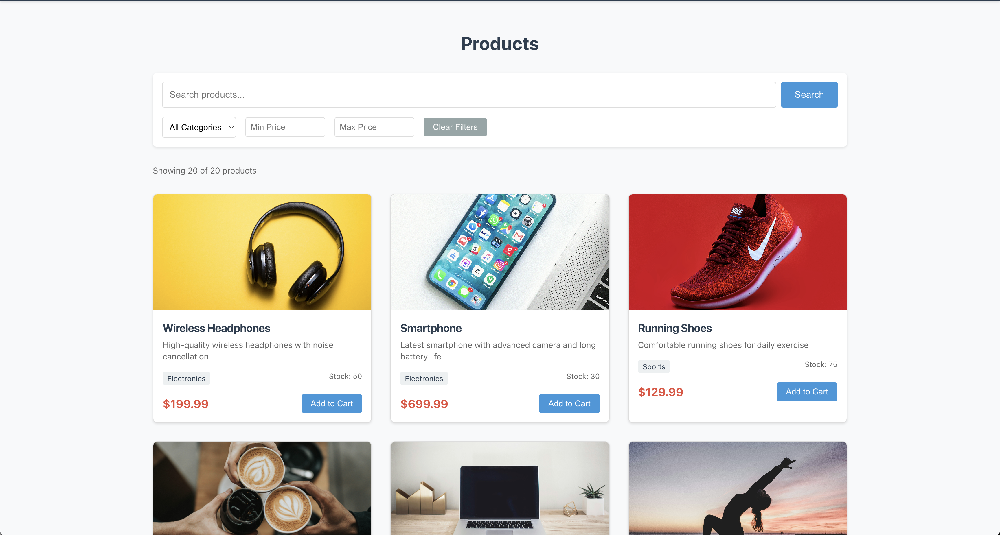

# Merchant Frontend

A sample React e-commerce frontend demonstrating integration with the Trusted Agent Protocol (TAP) for signature-based authentication.

## Environment Configuration

Create a `.env` file:

```bash
VITE_API_BASE_URL=http://localhost:8000
VITE_CDN_PROXY_URL=http://localhost:3001
```

## Features

- 🛍️ **E-commerce Sample**: Products, shopping cart, and checkout flow
- 🔐 **TAP Integration**: Works with signature-verified requests
- 📱 **Responsive Design**: Mobile-friendly interface
- 🛒 **Cart Management**: Session-based shopping cart


## Quick Start

```bash
# Install dependencies
npm install

# Start development server
npm run dev
```

Available at http://localhost:3001

## Sample Merchant UI


> **Note**: Requires Merchant Backend (port 8000) and CDN Proxy (port 3001)

## Key Pages

- **Product Catalog** - Browse available products
- **Product Details** - Individual product view with cart functionality
- **Shopping Cart** - Review and manage cart items
- **Checkout** - Complete purchase flow
- **Orders** - Order history and tracking


## Technology Stack

- **React 19** with Vite for fast development
- **React Router** for client-side routing
- **Axios** for API requests
- **Context API** for state management

## Development

```bash
# Build for production
npm run build && npm run preview
```

## Architecture

This sample demonstrates:
- Modern React patterns with hooks and context
- Integration with signature-verified APIs
- E-commerce UI/UX best practices
- Error handling and loading states
